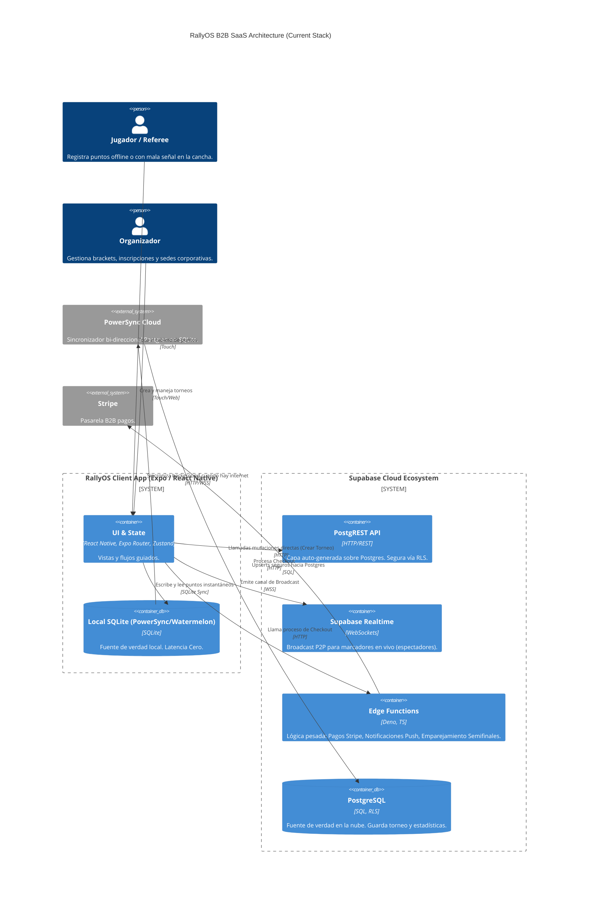

# RallyOS Architecture Proposal (Q2 2026)

Basado en el acoplamiento profundo (y ahora celebrado) con Supabase y tu requisito explícito de tener una experiencia **Offline-First (Latencia Cero) para el Scorerecard**, esta es la arquitectura definitiva que deberías implementar. 

He descartado pilas tradicionales (Node.js/Express) porque agregarían latencia, costos y duplicarían código de seguridad (PostgREST RLS ya lo maneja).

## 1. Topología del Sistema (C4 Container Diagram)

---

## 2. Definición del Stack Tecnológico

### Capa Frontend (Client-Side)
-   **Framework:** `Expo` (React Native). Permite exportar a Web, iOS y Android con una sola base de código (Expo Router para la navegación universal).
-   **Local Database & Sync (El corazón Offline-First):** `PowerSync` (o alternativamente `WatermelonDB`). 
    -   *¿Por qué?* Mencionaste que necesitamos *Latencia Cero* y que *desactivamos los triggers del DB para hacer el score optimista*. Con PowerSync + Supabase, tú haces un `INSERT` en la BD local de SQLite del teléfono en 1 milisegundo. La app avanza. Cuando vuelve el 4G, PowerSync envía el batch a Postgres de forma silenciosa.
-   **State Management:** `Zustand` (UI state rápido) combinado con Queries directos al Local SQLite.
-   **Styling:** `NativeWind` o `Tamagui` (Recomiendo usar tokens muy firmes para no romper el layout).

### Capa Backend (Supabase)
Aquí aplicamos el patrón **BaaS (Backend as a Service)** Thin-Client. Significa: "Menos código en el medio, mejor".
-   **API Core:** `@supabase/supabase-js`. Lee y escribe directamente a las tablas. La seguridad la garantiza el RLS y los JWT, no controladores intermedios.
-   **Lógica de Negocios Pesada (Microservicios):** `Supabase Edge Functions` (Deno). ¿Dónde pones esto?
    1.  Procesamiento de pagos (Stripe Webhooks).
    2.  Envío de notificaciones (Expo Push Notifications).
    3.  Lógica de torneos muy pesada: Ejemplo, cerrar Fase de Grupos y disparar la creación de llaves (Brackets) de eliminatoria.
-   **Live Score (Transmisión a espectadores):** `Supabase Realtime (Broadcast)`. En vez de grabar cada "15-0" en la BD (lo cual colgaría la red), el dispositivo emite un suceso efímero por WebSocket a los teléfonos de la grada. Solo graba en la BD local de SQLite (y sincroniza a Postgres) cuando termina el *Juego* o el *Set*.

---

## 3. ¿Por qué NO usar un Backend Tradicional (Node/NestJS)?

Podrías estar tentado a poner un NestJS, Express o Go Lang entre el celular y Supabase. **¡NO lo hagas!**
1.  **Duplicación Inútil**: Vas a tener que re-escribir la autenticación y el Row Level Security en controladores HTTP.
2.  **Anti-Offline**: Un backend REST tradicional te obliga a tener buena conexión a internet para avanzar la UI. Si usas directamente el túnel Supabase->PowerSync->App, rompes esa atadura.
3.  **Cuello de botella de Startups**: Agregar un repo de Backend y un servidor requiere mantener 2 pipelines, configurar Docker, Swagger y balanceadores de carga. Mantener la lógica en **Edge Functions** (Deno TS) bajo el ecosistema Supabase reduce drásticamente tu TCO (Total Cost of Ownership).

## Veredicto de Implementación
Empieza inicializando un monolito frontend en **Expo**. Implementa `@supabase/supabase-js` para loguear y `PowerSync` (Local SQLite) para la tabla Score. Resto de mutaciones via PostgREST estándar.
