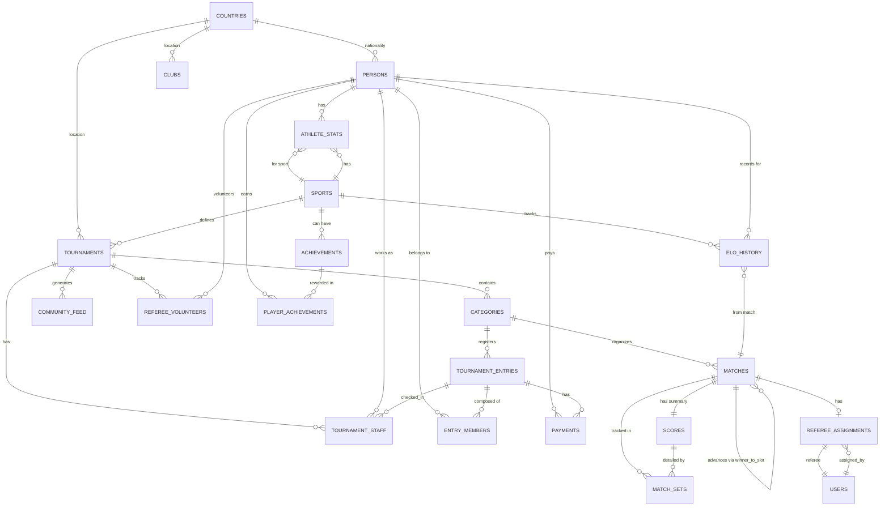
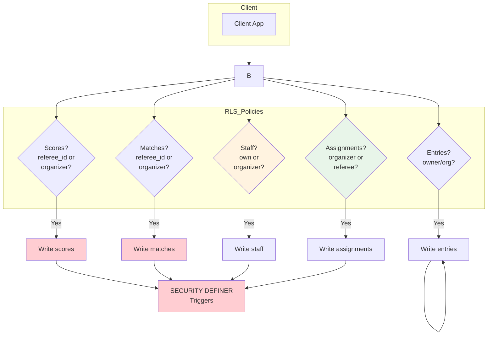
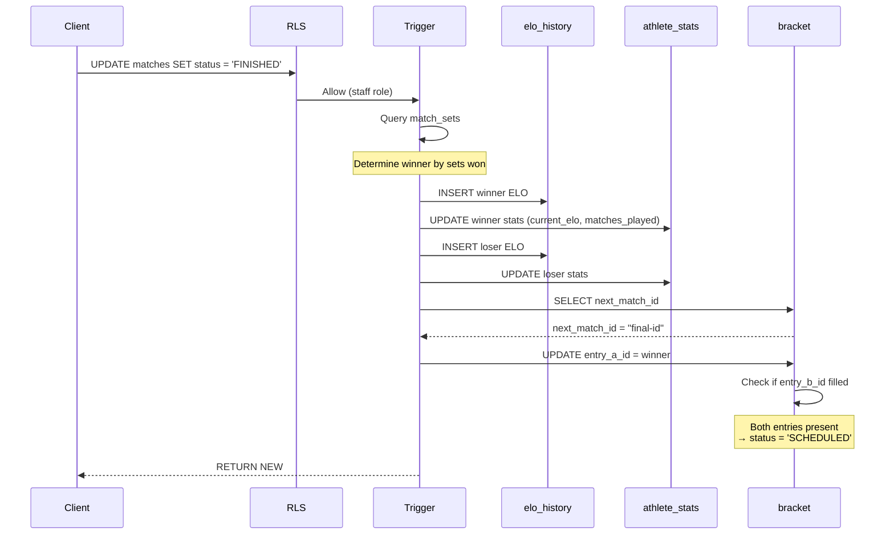

# RallyOS: Architecture Diagrams

**Generated**: 2026-03-30  
**Last Updated**: 2026-04-02 (Staff & Player-As-Referee System)

---

## System Flow

```mermaid
graph TD
    subgraph Tournament_Creation
        A[User creates Tournament] --> B[Tournament INSERT]
        B --> C[Trigger: Assign Organizer]
        C --> D[tournament_staff INSERT]
    end

    subgraph Registration
        E[Player registers] --> F[tournament_entries INSERT]
        F --> G{Payment required?}
        G -->|Yes| H[status: PENDING_PAYMENT]
        G -->|No| I[status: CONFIRMED]
        H --> J[Webhook: Payment confirmed]
        J --> I
    end

    subgraph CheckIn_and_Referees
        I --> K[Player Check-In]
        K --> L{Player wants to referee?}
        L -->|Yes| M[toggle_referee_volunteer(true)]
        M --> N[Creates referee_volunteers + PLAYER_REFEREE]
        L -->|No| O[Continues as player only]
    end

    subgraph Bracket_and_Referees
        P[Organizer generates bracket] --> Q[generate_bracket()]
        Q --> R[Organizer generates suggestions]
        R --> S[generate_referee_suggestions()]
        S --> T[referee_assignments (suggested)]
        T --> U[Organizer confirms]
        U --> V[confirm_referee_assignment()]
        V --> W[matches.referee_id = user_id]
    end

    subgraph Match_Flow
        W --> X[Match starts]
        X --> Y[matches.status = 'LIVE']
        Y --> Z[Referee updates scores]
        Z --> Z1{PIN Correct?}
        Z1 -->|Yes| AA{match ends?}
        Z1 -->|No| Z
        AA -->|No| Z
        AA -->|Yes| AB[matches.status = 'FINISHED']
    end

    subgraph ELO_Calculation
        AB --> AC[Trigger: process_match_completion]
        AC --> AD[Query match_sets for winner]
        AD --> AE[Calculate ELO]
        AE --> AF[elo_history INSERT]
        AE --> AG[athlete_stats UPDATE]
    end

    subgraph Bracket_Advancement
        AB --> AH[Trigger: advance_bracket_winner]
        AH --> AI[Get winner based on match_sets]
        AI --> AJ{next_match_id exists?}
        AJ -->|Yes| AK[Place winner in winner_to_slot]
        AJ -->|No| AL[Championship complete]
        AK --> AM{Both slots filled?}
        AM -->|Yes| AN[Next match ready]
        AM -->|No| AO[Waiting for opponent]
    end

    style ELO_Calculation fill:#e1f5fe
    style Bracket_Advancement fill:#fff3e0
    style CheckIn_and_Referees fill:#f3e5f5
    style Bracket_and_Referees fill:#e8f5e9
```

---

## Staff Management Flow

```mermaid
graph TD
    subgraph Invitation_Workflow
        A[Organizer] --> B{Assign directly or Invite?}
        B -->|Direct| C[assign_staff(invite_mode=false)]
        C --> D[status: ACTIVE]
        B -->|Invite| E[invite_staff()]
        E --> F[status: PENDING]
        F --> G[Invitee receives notification]
        G --> H{Accept or Reject?}
        H -->|Accept| I[accept_invitation()]
        I --> J[status: ACTIVE]
        H -->|Reject| K[reject_invitation()]
        K --> L[status: REJECTED]
        H -->|Timeout| M[expires_at passed]
        M --> N[status: REVOKED]
    end

    subgraph Player_Referee_Flow
        O[Player] --> P{Checked-In?}
        P -->|No| Q[Cannot volunteer]
        P -->|Yes| R[Player has user_id?]
        R -->|No| S[Shadow profile - Cannot volunteer]
        R -->|Yes| T[toggle_referee_volunteer(true)]
        T --> U[referee_volunteers.is_active = true]
        T --> V[tournament_staff: PLAYER_REFEREE, ACTIVE]
    end

    style Invitation_Workflow fill:#fff3e0
    style Player_Referee_Flow fill:#e3f2fd
```

---

## Database Schema



---

## RLS Security Model (v2)



### RLS Policy Matrix

| Operation | ORGANIZER | EXTERNAL_REFEREE | PLAYER_REFEREE | PLAYER |
|-----------|-----------|------------------|----------------|--------|
| View staff list | ✅ | ❌ | ❌ | ❌ |
| Manage staff | ✅ | ❌ | ❌ | ❌ |
| Create categories | ✅ | ❌ | ❌ | ❌ |
| Generate brackets | ✅ | ❌ | ❌ | ❌ |
| View matches | ✅ | ✅ | ✅ | ✅ |
| Assign referee | ✅ | ❌ | ❌ | ❌ |
| Update scores | ✅ | ✅ (assigned) | ✅ (assigned) | ❌ |
| Volunteer as referee | ❌ | ❌ | ✅ | ❌ |

---

## Match Completion Flow



---

## Bracket Structure (Single Elimination)

```
┌─────────────────────────────────────────────────────────────┐
│                    TOURNAMENT BRACKET                         │
├─────────────────────────────────────────────────────────────┤
│                                                             │
│   Semifinal 1              ┌─────────────────────┐         │
│  ┌─────────────────┐       │                     │         │
│  │ Player A (ELO+) │───────┤► Final              │         │
│  │ vs              │       │  ┌─────────────────┐│         │
│  │ Player B (ELO-) │       │  │ Winner Semi 1   ││         │
│  └─────────────────┘       │  │ vs              ││         │
│         │                   │  │ Winner Semi 2   ││         │
│  [Winner advances]          │  └─────────────────┘│         │
│         │                   │         │           │         │
│   Semifinal 2              │   [Champion!]        │         │
│  ┌─────────────────┐       │         │           │         │
│  │ Player C (ELO+) │───────┤►         ▼           │         │
│  │ vs              │       │    ┌─────────┐      │         │
│  │ Player D (ELO-) │       │    │ Trophy  │      │         │
│  └─────────────────┘       │    └─────────┘      │         │
│                             └─────────────────────┘         │
│                                                             │
│   [Referee: Player E]     [Referee: Player F]              │
│                                                             │
└─────────────────────────────────────────────────────────────┘

LEGEND:
- ELO+: Higher seeded player
- ELO-: Lower seeded player
- Referee: Players from OTHER matches (not playing)
```

---

## Key Triggers Reference

```yaml
# Existing Triggers
trg_update_athlete_rank:          athlete_stats, BEFORE UPDATE, Rank Up (Bronze-Diamond)
trg_generate_match_pin:           matches, BEFORE INSERT, Identity security
trg_match_completion:             matches, AFTER UPDATE, REAL ELO Logic
trg_advance_bracket:              matches, AFTER UPDATE, Deterministic Advancement
trg_tournament_created_assign_organizer: tournaments, AFTER INSERT, Creator auth
trg_scores_conflict_resolution:   scores, BEFORE UPDATE, Offline sync protection
trg_check_single_active_staff:    tournament_staff, BEFORE INSERT/UPDATE, Single ACTIVE

# NEW Triggers (v2)
trg_update_referee_stats:         referee_assignments, AFTER UPDATE, Incrementa matches_refereed
```

---

## ELO Calculation Formula

```
Expected Score = 1 / (1 + 10^((Opponent Rating - Player Rating) / 400))

New Rating = Old Rating + K × (Actual Score - Expected Score)

Where:
- Actual Score = 1 (win), 0.5 (draw), 0 (loss)
- K-factor = 32 (< 30 matches), 24 (30-100), 16 (> 100)
```

---

## Available Referees Query Logic

```sql
-- Players available to referee a specific match:
SELECT p.user_id, p.id AS person_id
FROM matches m
JOIN categories c ON c.id = m.category_id
JOIN tournaments t ON t.id = c.tournament_id
JOIN tournament_entries te ON te.category_id = c.id
JOIN entry_members em ON em.entry_id = te.id
JOIN persons p ON p.id = em.person_id
WHERE te.checked_in_at IS NOT NULL          -- Must be checked-in
  AND p.user_id IS NOT NULL                 -- Must have auth account
  AND p.user_id NOT IN (                    -- Must NOT be playing this match
      SELECT p2.user_id
      FROM matches m2
      JOIN tournament_entries te2 ON te2.category_id = m2.category_id
      JOIN entry_members em2 ON em2.entry_id = te2.id
      JOIN persons p2 ON p2.id = em2.person_id
      WHERE m2.id = m.id
  )
  AND NOT EXISTS (                          -- Must NOT be assigned to another match
      SELECT 1 FROM referee_assignments ra
      WHERE ra.user_id = p.user_id AND ra.is_confirmed = TRUE
  );
```

---

*Related Documents:*
- [ER Diagram](./ER_DIAGRAM.md)
- [Database Schema](../database/schema.md)
- [RLS Model](../security/rlsmodel.md)
- [Architecture Strategy](../ARCHITECTURE.md)
