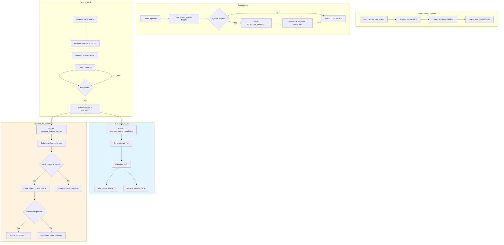
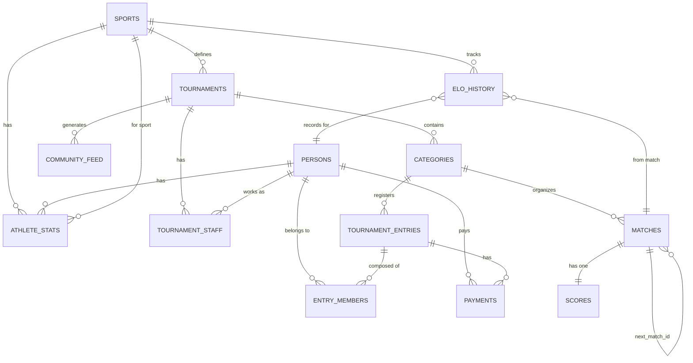
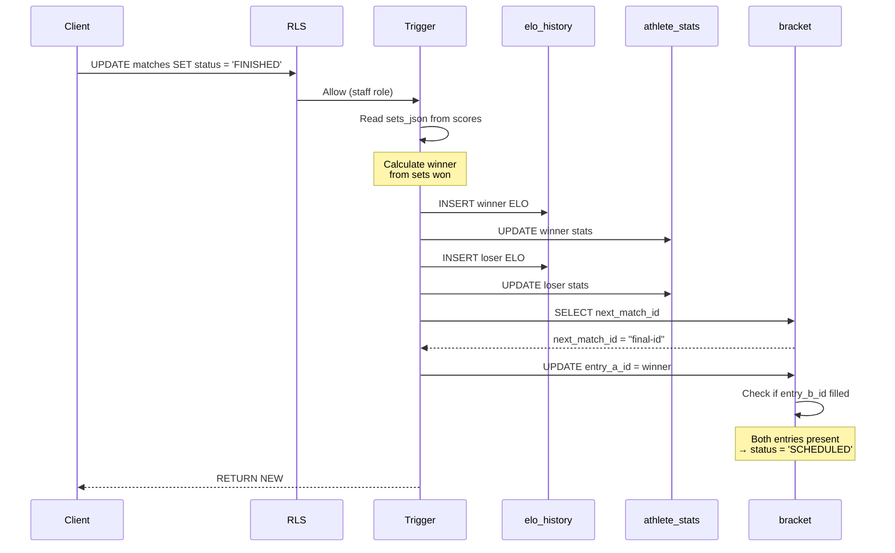
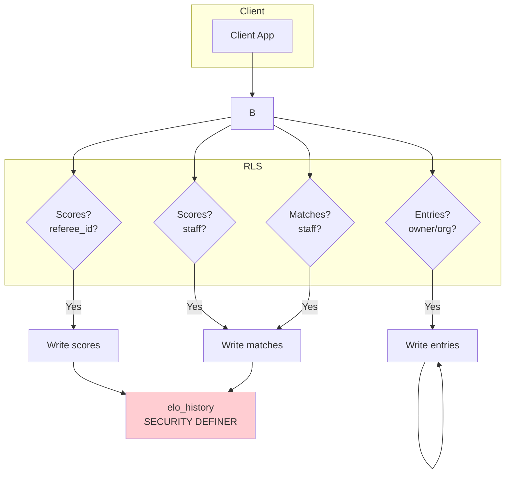

# RallyOS: Architecture Diagrams

**Generated**: 2026-03-30  
**Related**: `docs/ARCHITECTURE.md` (strategy), `docs/MIGRATION_INDEX.md` (migrations)

---

## System Flow



## Database Schema



## Match Completion Flow



## RLS Security Model



## Bracket Structure (Single Elimination)

```
┌─────────────────────────────────────────────────────────────┐
│                    TOURNAMENT BRACKET                         │
├─────────────────────────────────────────────────────────────┤
│                                                             │
│   Semifinal 1              ┌─────────────────────┐         │
│  ┌─────────────────┐       │                     │         │
│  │ Felipe Wolf     │───────┤► Final              │         │
│  │ vs              │       │  ┌─────────────────┐│         │
│  │ Carlos Perez    │       │  │ Winner Semi 1   ││         │
│  └─────────────────┘       │  │ vs              ││         │
│         │                   │  │ Winner Semi 2   ││         │
│  [Winner advances]          │  └─────────────────┘│         │
│         │                   │         │           │         │
│   Semifinal 2              │   [Champion!]        │         │
│  ┌─────────────────┐       │         │           │         │
│  │ Andres Rojas    │───────┤►         ▼           │         │
│  │ vs              │       │    ┌─────────┐      │         │
│  │ Miguel Torres   │       │    │ Trophy  │      │         │
│  └─────────────────┘       │    └─────────┘      │         │
│                             └─────────────────────┘         │
│                                                             │
└─────────────────────────────────────────────────────────────┘

NEXT_MATCH_ID links:
  Semifinal 1.next_match_id → Final
  Semifinal 2.next_match_id → Final
```

## Key Triggers Reference

```yaml
trg_matches_conflict_resolution:     matches,  BEFORE UPDATE, Time-tampering protection
trg_scores_conflict_resolution:     scores,   BEFORE UPDATE, Time-tampering protection
trg_match_completion:               matches,  AFTER UPDATE, ELO calculation
trg_advance_bracket:               matches,  AFTER UPDATE, Winner advancement
trg_tournament_created_assign_organizer: tournaments, AFTER INSERT, Auto-assign creator
```

## ELO Calculation Formula

```
Expected Score = 1 / (1 + 10^((Opponent Rating - Player Rating) / 400))

New Rating = Old Rating + K × (Actual Score - Expected Score)

Where:
- Actual Score = 1 (win), 0.5 (draw), 0 (loss)
- K-factor = 32 (< 30 matches), 24 (30-100), 16 (> 100)
```
