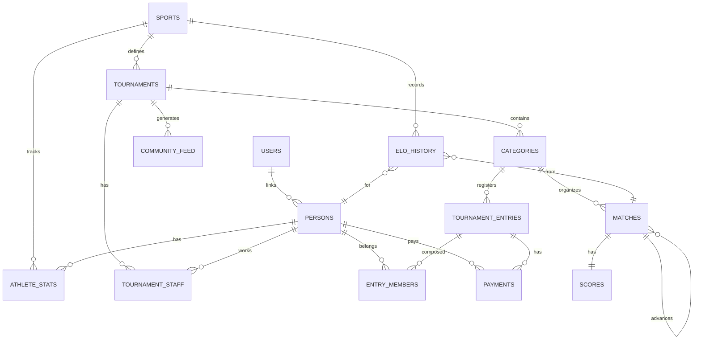

# RallyOS: Entity Relationship Diagram

**Generated**: 2026-03-30

---

## Complete ER Diagram



---

## Table Details

```yaml
SPORTS:           id, name
TOURNAMENTS:      id, sport_id, name, status
CATEGORIES:       id, tournament_id, name, mode
PERSONS:          id, user_id, first_name, last_name
USERS:            id
ATHLETE_STATS:    id, person_id, sport_id, current_elo
TOURNAMENT_STAFF: id, tournament_id, user_id, role
TOURNAMENT_ENTRIES: id, category_id, display_name, status
ENTRY_MEMBERS:    id, entry_id, person_id
MATCHES:          id, category_id, entry_a_id, entry_b_id, next_match_id
SCORES:           id, match_id, sets_json
ELO_HISTORY:      id, person_id, match_id, elo_change
PAYMENTS:         id, tournament_entry_id, status
COMMUNITY_FEED:   id, tournament_id, event_type
```

---

## Cardinality Legend

```
||--o{   one-to-many (nullable)
||--||   one-to-one
}o--o|   many-to-many
||--{    one-to-many (required)
}o--||   many-to-one
```

---

## Enums Reference

```yaml
sport_scoring_system: POINTS, GAMES
tournament_status:    DRAFT, REGISTRATION, CHECK_IN, LIVE, COMPLETED
match_status:        SCHEDULED, CALLING, READY, LIVE, FINISHED, W_O, SUSPENDED
game_mode:           SINGLES, DOUBLES, TEAMS
bracket_system:      SINGLE_ELIMINATION, ROUND_ROBIN
entry_status:        PENDING_PAYMENT, CONFIRMED, CANCELLED
elo_change_type:     MATCH_WIN, MATCH_LOSS, ADJUSTMENT
payment_status:      REQUIRES_PAYMENT, PROCESSING, SUCCEEDED, FAILED, REFUNDED
```
