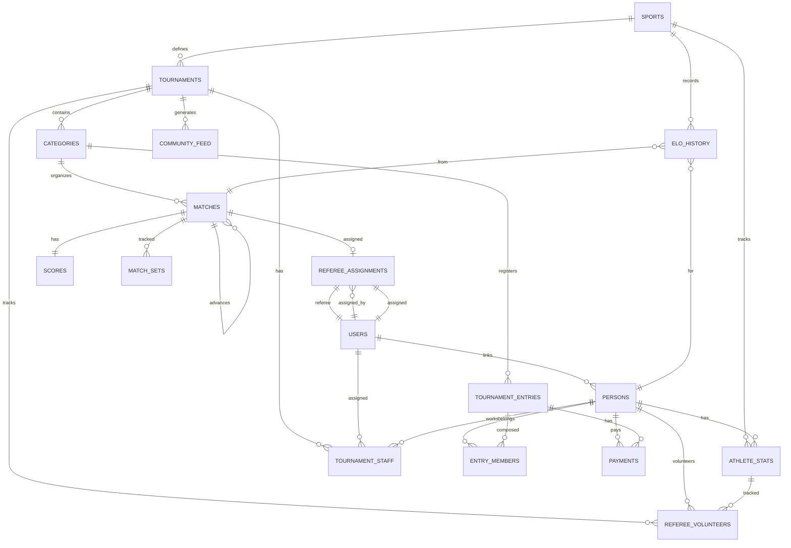

# RallyOS: Entity Relationship Diagram

**Generated**: 2026-04-02  
**Last Updated**: Sport-Specific Scoring Rules Engine (COMPLETE + E2E Tests PASS)

---

## Complete ER Diagram



---

## Table Details

```yaml
SPORTS:                 id, name, scoring_system, default_points_per_set, default_best_of_sets, scoring_config (JSONB)
TOURNAMENTS:            id, sport_id, name, status, handicap_enabled, use_differential
CATEGORIES:             id, tournament_id, name, mode, points_override, sets_override, elo_min, elo_max
PERSONS:                id, user_id, first_name, last_name, nickname, nationality_country_id
USERS:                  id (from Supabase Auth)
ATHLETE_STATS:          id, person_id, sport_id, current_elo, matches_played, matches_refereed, rank
TOURNAMENT_STAFF:       id, tournament_id, user_id, role, status, invite_mode, invited_by, expires_at
TOURNAMENT_ENTRIES:     id, category_id, display_name, current_handicap, status, fee_amount_snap, checked_in_at
ENTRY_MEMBERS:          id, entry_id, person_id
MATCHES:                id, category_id, entry_a_id, entry_b_id, referee_id, next_match_id, winner_to_slot, pin_code, court_id, status, round_name
SCORES:                 id, match_id, current_set, points_a, points_b
MATCH_SETS:             id, match_id, set_number, points_a, points_b, is_finished
ELO_HISTORY:            id, person_id, sport_id, match_id, previous_elo, new_elo, elo_change, change_type
PAYMENTS:                id, tournament_entry_id, user_id, provider, provider_txn_id, amount, currency, status
COMMUNITY_FEED:         id, tournament_id, event_type, payload_json
REFEREE_VOLUNTEERS:     id, tournament_id, person_id, user_id, is_active
REFEREE_ASSIGNMENTS:    id, match_id, user_id, assigned_by, is_suggested, is_confirmed
```

---

## Cardinality Legend

```
||--o{   one-to-many (nullable)
||--||   one-to-one
}o--o|   many-to-many
||--{    one-to-many (required)
}o--||   many-to-one
```

---

## Enums Reference

```yaml
# Existing Enums
sport_scoring_system: POINTS, GAMES
tournament_status:    DRAFT, REGISTRATION, CHECK_IN, LIVE, COMPLETED
match_status:        SCHEDULED, CALLING, READY, LIVE, FINISHED, W_O, SUSPENDED
game_mode:           SINGLES, DOUBLES, TEAMS
bracket_system:      SINGLE_ELIMINATION, ROUND_ROBIN
entry_status:        PENDING_PAYMENT, CONFIRMED, CANCELLED
elo_change_type:     MATCH_WIN, MATCH_LOSS, ADJUSTMENT
payment_status:      REQUIRES_PAYMENT, PROCESSING, SUCCEEDED, FAILED, REFUNDED
athlete_rank:        BRONZE, SILVER, GOLD, PLATINUM, DIAMOND

# NEW: Staff & Player-As-Referee Enums
staff_role:          ORGANIZER, EXTERNAL_REFEREE, PLAYER_REFEREE
staff_status:        PENDING, ACTIVE, REJECTED, REVOKED
```

---

## New Relationships (v2)

### Tournament Staff Flow

```
┌─────────────────────────────────────────────────────────────────┐
│                    STAFF ASSIGNMENT MODELS                        │
├─────────────────────────────────────────────────────────────────┤
│                                                                 │
│  ORGANIZER (creates tournament)                                  │
│       │                                                         │
│       ├── invite_staff() ──→ EXTERNAL_REFEREE (PENDING)         │
│       │                       │                                 │
│       │                       └── accept_invitation() ──→ ACTIVE│
│       │                                                      │   │
│       └── assign_staff() ──→ PLAYER_REFEREE (ACTIVE) ◄────────┤
│                              (requires check-in)                 │
│                                                                 │
└─────────────────────────────────────────────────────────────────┘
```

### Player-As-Referee Flow

```
┌─────────────────────────────────────────────────────────────────┐
│                  PLAYER-AS-REFEREE SYSTEM                        │
├─────────────────────────────────────────────────────────────────┤
│                                                                 │
│  Player Checked-In                                               │
│       │                                                         │
│       └── toggle_referee_volunteer(true)                         │
│                     │                                            │
│                     ├──→ referee_volunteers (is_active=true)    │
│                     └──→ tournament_staff (PLAYER_REFEREE, ACTIVE)│
│                                                                 │
│  Organizer → generate_referee_suggestions()                      │
│                     │                                            │
│                     └──→ referee_assignments (suggested=true)     │
│                                                                 │
│  Organizer → confirm_referee_assignment()                        │
│                     │                                            │
│                     ├──→ referee_assignments (is_confirmed=true) │
│                     └──→ matches.referee_id = user_id            │
│                                                                 │
└─────────────────────────────────────────────────────────────────┘
```
