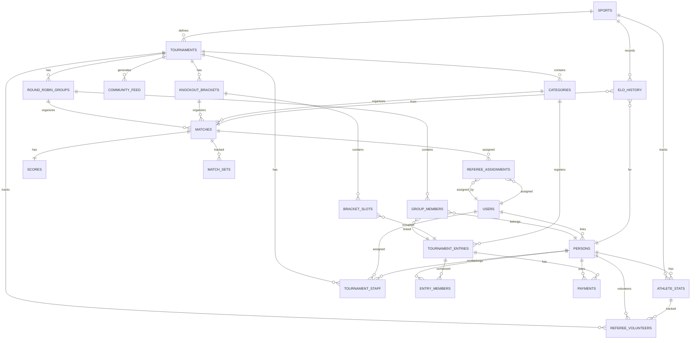

# RallyOS: Entity Relationship Diagram

**Generated**: 2026-04-02  
**Last Updated**: Round Robin Groups + Loser-As-Referee COMPLETE

---

## Complete ER Diagram



---

## Table Details

```yaml
SPORTS:                 id, name, scoring_system, default_points_per_set, default_best_of_sets, scoring_config (JSONB)
TOURNAMENTS:            id, sport_id, name, status, handicap_enabled, use_differential
CATEGORIES:             id, tournament_id, name, mode, points_override, sets_override, elo_min, elo_max
PERSONS:                id, user_id, first_name, last_name, nickname, nationality_country_id
USERS:                  id (from Supabase Auth)
ATHLETE_STATS:          id, person_id, sport_id, current_elo, matches_played, matches_refereed, rank
TOURNAMENT_STAFF:       id, tournament_id, user_id, role, status, invite_mode, invited_by, expires_at
TOURNAMENT_ENTRIES:     id, category_id, display_name, current_handicap, status, fee_amount_snap, checked_in_at
ENTRY_MEMBERS:          id, entry_id, person_id
MATCHES:                id, category_id, entry_a_id, entry_b_id, group_id, bracket_id, phase, round_number, next_match_id, loser_assigned_referee, referee_id, winner_to_slot, pin_code, court_id, status, round_name
SCORES:                 id, match_id, current_set, points_a, points_b
MATCH_SETS:             id, match_id, set_number, points_a, points_b, is_finished
ELO_HISTORY:            id, person_id, sport_id, match_id, previous_elo, new_elo, elo_change, change_type
PAYMENTS:               id, tournament_entry_id, user_id, provider, provider_txn_id, amount, currency, status
COMMUNITY_FEED:         id, tournament_id, event_type, payload_json
REFEREE_VOLUNTEERS:     id, tournament_id, person_id, user_id, is_active
REFEREE_ASSIGNMENTS:    id, match_id, user_id, assigned_by, is_suggested, is_confirmed, assignment_type
ROUND_ROBIN_GROUPS:     id, tournament_id, name, advancement_count, status, created_at, updated_at
GROUP_MEMBERS:          id, group_id, person_id, entry_id, seed, status, check_in_at, round_bye
KNOCKOUT_BRACKETS:      id, tournament_id, status, third_place_enabled, created_at, updated_at
BRACKET_SLOTS:          id, bracket_id, position, round, round_name, entry_id, seed_source
```

---

## Cardinality Legend

```
||--o{   one-to-many (nullable)
||--||   one-to-one
}o--o|   many-to-many
||--{    one-to-many (required)
}o--||   many-to-one
```

---

## Enums Reference

```yaml
# Existing Enums
sport_scoring_system: POINTS, GAMES
tournament_status:    DRAFT, REGISTRATION, PRE_TOURNAMENT, CHECK_IN, LIVE, SUSPENDED, COMPLETED, CANCELLED
match_status:        SCHEDULED, CALLING, READY, LIVE, FINISHED, W_O, SUSPENDED
game_mode:           SINGLES, DOUBLES, TEAMS
bracket_system:      SINGLE_ELIMINATION, ROUND_ROBIN
entry_status:        PENDING_PAYMENT, CONFIRMED, CANCELLED
elo_change_type:     MATCH_WIN, MATCH_LOSS, ADJUSTMENT
payment_status:      REQUIRES_PAYMENT, PROCESSING, SUCCEEDED, FAILED, REFUNDED
athlete_rank:        BRONZE, SILVER, GOLD, PLATINUM, DIAMOND

# NEW: Staff & Player-As-Referee Enums
staff_role:          ORGANIZER, EXTERNAL_REFEREE, PLAYER_REFEREE
staff_status:        PENDING, ACTIVE, REJECTED, REVOKED
assignment_type:     AUTOMATIC, MANUAL, LOSER_ASSIGNED

# NEW: Round Robin Enums
group_status:        PENDING, IN_PROGRESS, COMPLETED
member_status:       ACTIVE, WALKED_OVER, DISQUALIFIED
bracket_status:      PENDING, IN_PROGRESS, COMPLETED
match_phase:         ROUND_ROBIN, KNOCKOUT, BRONZE, FINAL
```

---

## New Relationships (v2)

### Tournament Staff Flow

```
┌─────────────────────────────────────────────────────────────────┐
│                    STAFF ASSIGNMENT MODELS                        │
├─────────────────────────────────────────────────────────────────┤
│                                                                 │
│  ORGANIZER (creates tournament)                                  │
│       │                                                         │
│       ├── invite_staff() ──→ EXTERNAL_REFEREE (PENDING)         │
│       │                       │                                 │
│       │                       └── accept_invitation() ──→ ACTIVE│
│       │                                                      │   │
│       └── assign_staff() ──→ PLAYER_REFEREE (ACTIVE) ◄────────┤
│                              (requires check-in)                 │
│                                                                 │
└─────────────────────────────────────────────────────────────────┘
```

### Player-As-Referee Flow

```
┌─────────────────────────────────────────────────────────────────┐
│                  PLAYER-AS-REFEREE SYSTEM                        │
├─────────────────────────────────────────────────────────────────┤
│                                                                 │
│  Player Checked-In                                               │
│       │                                                         │
│       └── toggle_referee_volunteer(true)                         │
│                     │                                            │
│                     ├──→ referee_volunteers (is_active=true)    │
│                     └──→ tournament_staff (PLAYER_REFEREE, ACTIVE)│
│                                                                 │
│  Organizer → generate_referee_suggestions()                      │
│                     │                                            │
│                     └──→ referee_assignments (suggested=true)     │
│                                                                 │
│  Organizer → confirm_referee_assignment()                        │
│                     │                                            │
│                     ├──→ referee_assignments (is_confirmed=true) │
│                     └──→ matches.referee_id = user_id            │
│                                                                 │
└─────────────────────────────────────────────────────────────────┘
```

### Round Robin Flow

```
┌─────────────────────────────────────────────────────────────────┐
│                    ROUND ROBIN FLOW                              │
├─────────────────────────────────────────────────────────────────┤
│                                                                 │
│  1. PRE_TOURNAMENT: Create Groups                               │
│       │                                                         │
│       └── create_round_robin_group()                            │
│                     │                                           │
│                     ├──→ round_robin_groups                     │
│                     ├──→ group_members                          │
│                     └──→ matches (n*(n-1)/2)                    │
│                                                                 │
│  2. CHECK_IN: Players confirm attendance                        │
│       │                                                         │
│       └── update group_members.check_in_at                     │
│                                                                 │
│  3. LIVE: Play Round Robin                                      │
│       │                                                         │
│       ├── Match A1 vs A2                                       │
│       ├── suggest_intra_group_referee() → P3 (same group)      │
│       └── Score entered manually                                │
│                                                                 │
│  4. Match Complete                                              │
│       │                                                         │
│       ├── calculate_group_standings()                          │
│       ├── trg_update_group_status (auto)                       │
│       └── assign_loser_as_referee() → Loser → Next Match       │
│                                                                 │
│  5. All Groups COMPLETED                                        │
│       │                                                         │
│       └── generate_bracket_from_groups()                        │
│                     │                                           │
│                     ├──→ knockout_brackets                     │
│                     └──→ bracket_slots (seeded)                 │
│                                                                 │
└─────────────────────────────────────────────────────────────────┘
```

### Loser-As-Referee Flow

```
┌─────────────────────────────────────────────────────────────────┐
│                  LOSER ARBITRA AL GANADOR                        │
├─────────────────────────────────────────────────────────────────┤
│                                                                 │
│  Match: P1 defeats P2                                           │
│       │                                                         │
│       └── trg_track_loser_for_referee()                         │
│                     │                                           │
│                     ├──→ matches.next_match_of_winner            │
│                     └──→ matches.loser_assigned_referee = P2     │
│                                                                 │
│  Next Match: P1 vs P3                                           │
│       │                                                         │
│       ├── P2 is suggested as referee                            │
│       └── assignment_type = 'LOSER_ASSIGNED'                   │
│                                                                 │
│  EXCEPTION: Cross-Group                                         │
│       │                                                         │
│       ├── If P1's next match is in Group B                     │
│       └── P2 cannot referee (different group)                   │
│           → Organizer must assign manually                       │
│                                                                 │
└─────────────────────────────────────────────────────────────────┘
```

### Intra-Group Referee Constraint

```
┌─────────────────────────────────────────────────────────────────┐
│              INTRA-GROUP REFEREE RULE                            │
├─────────────────────────────────────────────────────────────────┤
│                                                                 │
│  VALID: Same group, not playing                                │
│  ┌─────────────────────────────────────────────────────┐        │
│  │  Group A: P1, P2, P3, P4                          │        │
│  │  Match: P1 vs P2                                    │        │
│  │  Valid Referees: P3, P4 (same group, not playing) │        │
│  └─────────────────────────────────────────────────────┘        │
│                                                                 │
│  INVALID: Different group                                        │
│  ┌─────────────────────────────────────────────────────┐        │
│  │  Group A: P1, P2, P3, P4                          │        │
│  │  Group B: Q1, Q2, Q3, Q4                          │        │
│  │  Match: P1 vs P2 (Group A)                         │        │
│  │  ❌ Q1, Q2, Q3, Q4 cannot referee (diff group)   │        │
│  └─────────────────────────────────────────────────────┘        │
│                                                                 │
│  ENFORCED BY: trg_validate_referee_assignment (if referee_mode=INTRA_GROUP) │
│                                                                 │
└─────────────────────────────────────────────────────────────────┘
```
