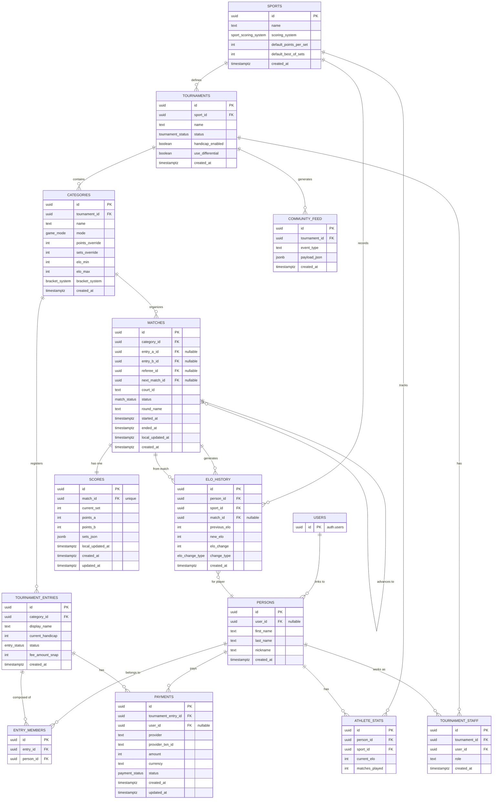

# RallyOS: Entity Relationship Diagram

**Generated**: 2026-03-30

---

## Complete ER Diagram



---

## Cardinality Legend

```mermaid
erDiagram
    A ||--o{ B : "one-to-many"
    A ||--|| B : "one-to-one"
    A }o--o{ B : "many-to-many"
    A ||--{ B : "one-to-many (not null)"
```

---

## Enums Reference

| Enum | Values |
|------|--------|
| `sport_scoring_system` | POINTS, GAMES |
| `tournament_status` | DRAFT, REGISTRATION, CHECK_IN, LIVE, COMPLETED |
| `match_status` | SCHEDULED, CALLING, READY, LIVE, FINISHED, W_O, SUSPENDED |
| `game_mode` | SINGLES, DOUBLES, TEAMS |
| `bracket_system` | SINGLE_ELIMINATION, ROUND_ROBIN |
| `entry_status` | PENDING_PAYMENT, CONFIRMED, CANCELLED |
| `elo_change_type` | MATCH_WIN, MATCH_LOSS, ADJUSTMENT |
| `payment_status` | REQUIRES_PAYMENT, PROCESSING, SUCCEEDED, FAILED, REFUNDED |
