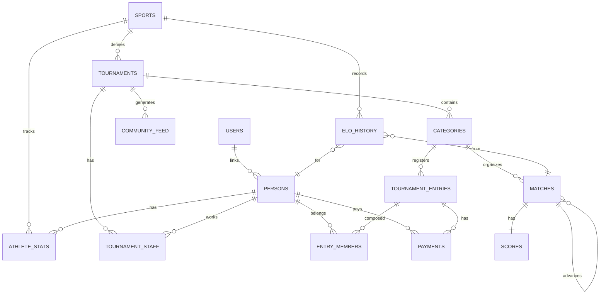

# RallyOS: Entity Relationship Diagram

**Generated**: 2026-03-30

---

## Complete ER Diagram



---

## Table Details

| Table | Key Columns | Description |
|-------|-------------|-------------|
| **SPORTS** | id, name | Sporting disciplines (tennis, padel, etc.) |
| **TOURNAMENTS** | id, sport_id, name, status | Tournament events |
| **CATEGORIES** | id, tournament_id, name, mode | Age/skill divisions within tournaments |
| **PERSONS** | id, user_id, first_name, last_name | User profiles |
| **USERS** | id | Auth.users reference |
| **ATHLETE_STATS** | id, person_id, sport_id, current_elo | Player statistics per sport |
| **TOURNAMENT_STAFF** | id, tournament_id, user_id, role | Staff assignments |
| **TOURNAMENT_ENTRIES** | id, category_id, display_name, status | Team/player registrations |
| **ENTRY_MEMBERS** | id, entry_id, person_id | Team composition |
| **MATCHES** | id, category_id, entry_a_id, entry_b_id, next_match_id | Match records |
| **SCORES** | id, match_id, sets_json | Score tracking |
| **ELO_HISTORY** | id, person_id, match_id, elo_change | Immutable ELO ledger |
| **PAYMENTS** | id, tournament_entry_id, status | Payment records |
| **COMMUNITY_FEED** | id, tournament_id, event_type | Activity feed |

---

## Cardinality Legend

```mermaid
erDiagram
    A ||--o{ B : "one-to-many"
    A ||--|| B : "one-to-one"
    A }o--o| B : "many-to-many"
    A ||--{ B : "one-to-many (not null)"
```

---

## Enums Reference

| Enum | Values |
|------|--------|
| `sport_scoring_system` | POINTS, GAMES |
| `tournament_status` | DRAFT, REGISTRATION, CHECK_IN, LIVE, COMPLETED |
| `match_status` | SCHEDULED, CALLING, READY, LIVE, FINISHED, W_O, SUSPENDED |
| `game_mode` | SINGLES, DOUBLES, TEAMS |
| `bracket_system` | SINGLE_ELIMINATION, ROUND_ROBIN |
| `entry_status` | PENDING_PAYMENT, CONFIRMED, CANCELLED |
| `elo_change_type` | MATCH_WIN, MATCH_LOSS, ADJUSTMENT |
| `payment_status` | REQUIRES_PAYMENT, PROCESSING, SUCCEEDED, FAILED, REFUNDED |
