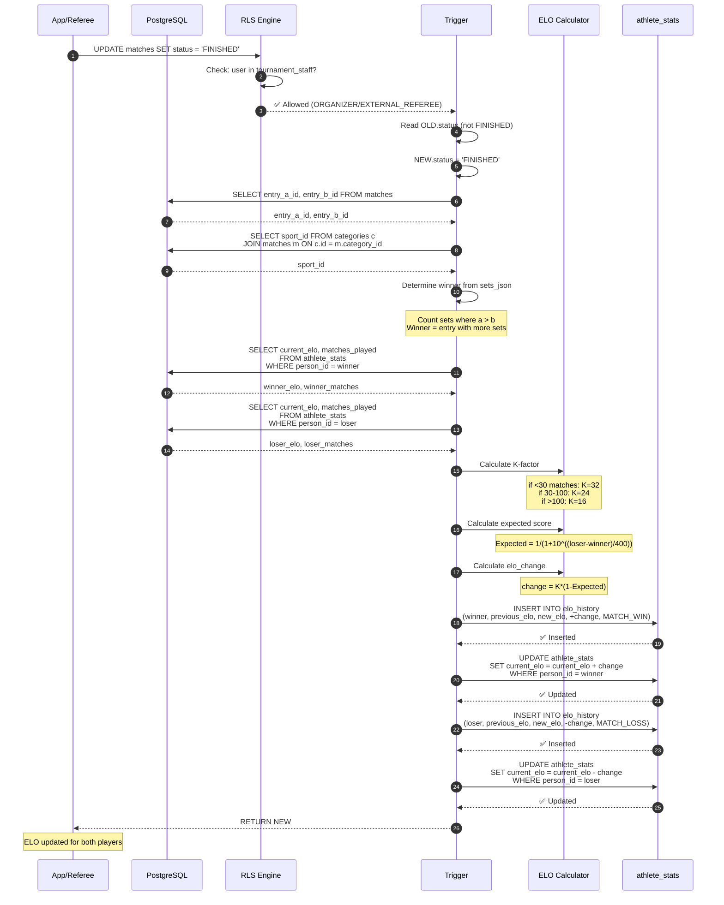
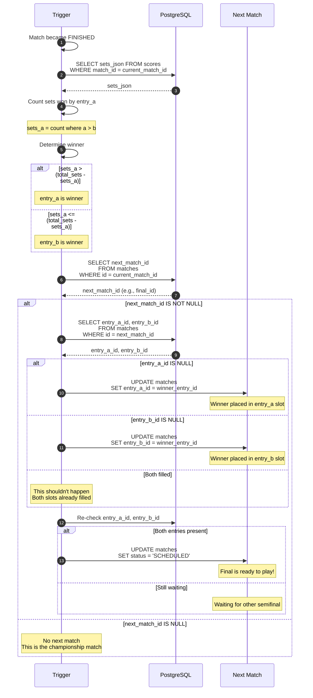
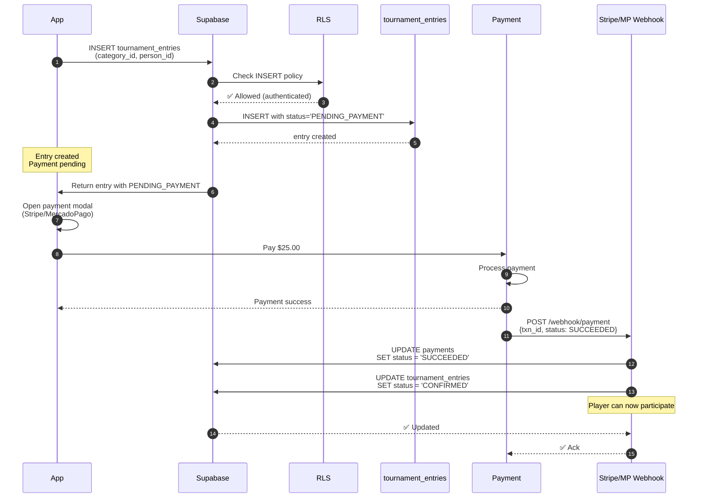
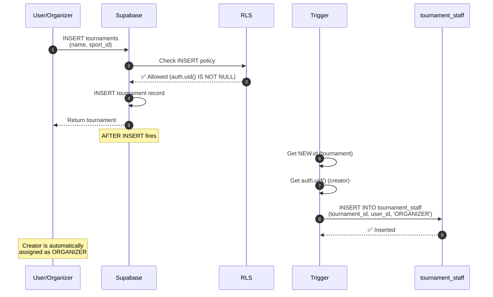
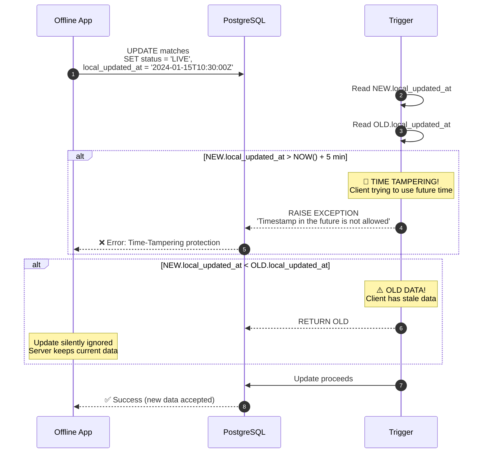

# RallyOS: Sequence Diagrams — Business Logic Flows

**Generated**: 2026-03-30

---

## 1. ELO Calculation on Match Completion

**Trigger**: `process_match_completion()`  
**When**: `matches.status` changes to `FINISHED`



### Test Scenarios

| Scenario | Input | Expected |
|----------|-------|----------|
| Winner gains ELO | 1000 vs 800, winner wins | Winner +8, Loser -8 |
| Higher ELO wins | 1200 vs 1000, higher wins | Small change (< 10) |
| Upset! | 1200 vs 1000, lower wins | Big change (> 15) |
| First match | 0 matches played | K = 32 |
| Veteran | 150 matches played | K = 16 |

---

## 2. Bracket Advancement

**Trigger**: `advance_bracket_winner()`  
**When**: `matches.status` changes to `FINISHED`



### Test Scenarios

| Scenario | Input | Expected |
|----------|-------|----------|
| Semifinal winner to Final | Semi1 finished, winner advances | Final.entry_a_id = winner |
| Both semifinals done | Semi1 + Semi2 finished | Final has both entries, status = SCHEDULED |
| Entry_b wins | 2-3 sets (b wins more) | entry_b_id placed in next match |
| No next match | Final match finishes | No error, no advancement |

---

## 3. Entry Registration with Payment Flow

**Flow**: Registration → Payment → Confirmation



### Test Scenarios

| Scenario | Input | Expected |
|----------|-------|----------|
| New entry starts pending | INSERT without status | status = PENDING_PAYMENT |
| Payment confirmed | Webhook calls UPDATE | status = CONFIRMED |
| Payment failed | Webhook calls UPDATE | status = CANCELLED |
| Non-owner can't confirm | Random user tries UPDATE | ❌ Blocked by RLS |
| Organizer can override | Organizer updates status | ✅ Allowed |

---

## 4. Tournament Creation with Auto-Organizer

**Trigger**: `assign_tournament_creator_as_organizer()`  
**When**: New tournament INSERT



---

## 5. Offline Sync Conflict Resolution

**Trigger**: `check_offline_sync_conflict()`  
**When**: UPDATE on matches/scores with `local_updated_at`



### Test Scenarios

| Scenario | Input | Expected |
|----------|-------|----------|
| Valid update | local_updated_at = NOW() | ✅ Accepted |
| Future timestamp | local_updated_at = +1 day | ❌ Blocked |
| Past timestamp | local_updated_at = yesterday | Silently ignored |
| Same timestamp | local_updated_at = OLD | Accepted |

---

## 6. Match Score Update (RLS Check)

**RLS Policy**: Only assigned referee can update scores

```mermaid
sequenceDiagram
    autonumber
    participant Referee as Assigned Referee
    participant App as Any User
    participant RLS as RLS
    participant Scores as scores

    Referee->>RLS: UPDATE scores<br/>SET points_a = 5<br/>WHERE match_id = 'match-123'
    
    RLS->>RLS: Check policy<br/>"Scores insert/update allowed<br/>only for assigned referee"
    RLS->>RLS: Verify referee_id matches auth.uid()
    RLS-->>Scores: ✅ Allowed
    
    Scores->>Scores: UPDATE points_a = 5
    Scores-->>Referee: ✅ Updated

   ---

    App->>RLS: UPDATE scores<br/>SET points_a = 5<br/>WHERE match_id = 'match-123'
    
    RLS->>RLS: Check referee_id = auth.uid()
    RLS-->>RLS: ❌ auth.uid() != referee_id
    RLS-->>App: ❌ Error 403<br/>'new row violates row-level<br/>security policy'
    Note over App: Blocked!<br/>Only referee can update
```

---

## Summary of Business Logic

| Flow | Trigger/Function | Status |
|------|-----------------|--------|
| ELO Calculation | `process_match_completion()` | ✅ Implemented |
| Bracket Advancement | `advance_bracket_winner()` | ✅ Implemented |
| Payment Confirmation | Webhook (manual) | ⚠️ Table ready |
| Auto-Organizer | `assign_tournament_creator_as_organizer()` | ✅ Implemented |
| Offline Sync Protection | `check_offline_sync_conflict()` | ✅ Implemented |
| Score RLS | Policy | ✅ Implemented |
